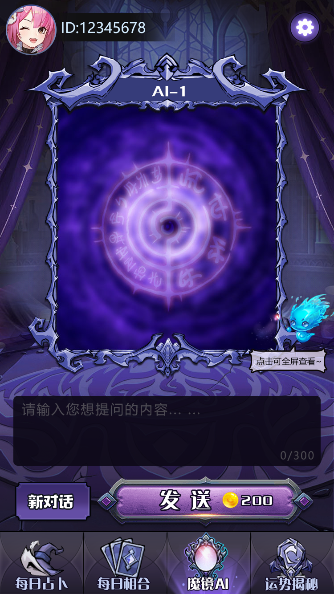
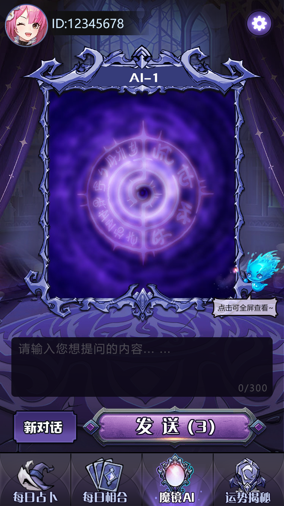
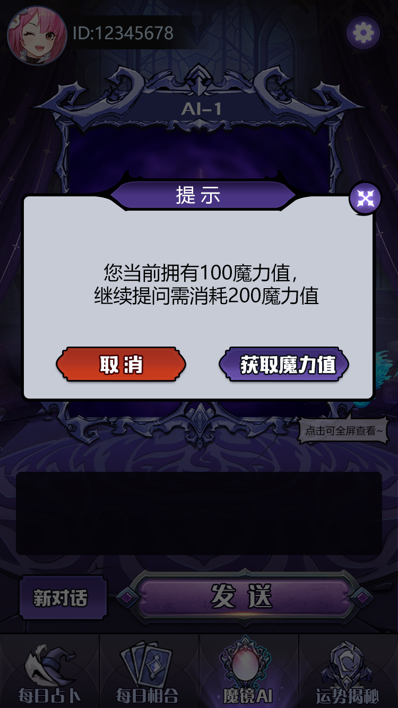
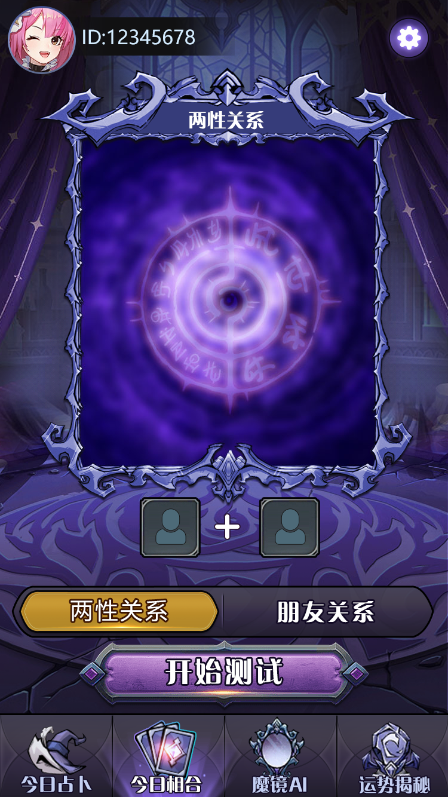

# 魔镜占卜 H5 小游戏源码

> AI 占卜 + 周易主题 + 姻缘/财运/事业/运势流程 + Java 后端 + H5 多平台。

## 项目是什么

这是一个面向 H5、微信/百度/头条等移动场景的魔镜占卜应用源码。用户从魔镜互动或主题入口开始，提交问题，查看占卜结果，保存历史记录并生成分享海报。线上仓库包含 Java 服务端类、三种语言 README 和真实产品截图。

## 主要功能

- 魔镜占卜：以互动镜面作为进入占卜流程的产品入口。
- 姻缘与爱情相合：围绕感情关系呈现主题结果。
- 财运、事业、综合运势：按常见咨询场景组织独立流程。
- AI 接口：线上说明标注 DeepSeek 与 ChatGPT 对接方向，实际密钥与模型参数需自行配置。
- 用户管理与占卜记录：保存用户操作和历史结果。
- 海报生成与分享：把结果整理成适合移动端传播的海报。
- 多平台 H5：适配微信、百度、头条及独立 H5 页面形态。

## 玩法流程

1. 选择魔镜、姻缘、财运、事业或运势主题。
2. 输入问题或按页面提示完成互动。
3. 阅读结果与解释内容。
4. 保存记录，生成海报并分享。

## 产品截图

## 技术组成

- Java 后端服务与用户/操作/海报服务类。
- H5/多平台前端流程。
- AI 服务接口适配层。
- 用户记录、结果展示与分享素材流程。

## 在线专题页

- [项目首页](https://masterai-top.github.io/Magic-Mirror-Game/)
- [魔镜占卜 H5](https://masterai-top.github.io/Magic-Mirror-Game/magic-mirror-divination/)
- [姻缘与爱情相合](https://masterai-top.github.io/Magic-Mirror-Game/love-fortune/)
- [AI 占卜接口](https://masterai-top.github.io/Magic-Mirror-Game/ai-divination/)
- [H5 Java 后端架构](https://masterai-top.github.io/Magic-Mirror-Game/h5-architecture/)

## 联系方式

- Telegram: [@xuzongbin001](https://t.me/xuzongbin001)
- Email: [masterai918@gmail.com](mailto:masterai918@gmail.com)

## 合规说明

本项目适合软件开发、产品演示和娱乐内容研究。占卜结果不构成医疗、法律或投资建议，部署时请遵守当地法律、平台规则并保护用户隐私。
